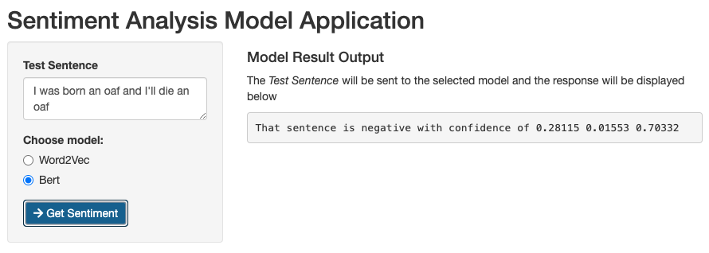

# Sentiment Analysis of the Simpsons Dialogue
_Note:_ This project is derived from [this](https://www.cloudera.com/about/events/webinars/build-a-sentiment-analysis-application-in-cdp.html) Cloudera Machine Learning 
([CML](https://www.cloudera.com/products/machine-learning.html)) **Applied Machine Learning 
Project Prototype** project. It's a bit less CML specific and drops the python parts. It's 
now pretty much all done with [sparklyr](https://spark.rstudio.com)

Images Source: https://toddwschneider.com/posts/the-simpsons-by-the-data/

## Project Overview
Ever wondered who the happiest Simpsons character is and what you can do once armed with that
knowledge? This project is for you! 

*Note:* There is a lot of supporting info and documentation in each of the project files, so it's
worth taking a look through the files.

This project is 2 main parts:
1. Data Analysis
2. Model Deployment

### Part 1: Data Analysis
`1_Data_Analysis.Rmd` and `2_Sentiment_Score_Creator.R`

These two files go through the process of creating a labelled data set that gives a sentiment
score to each line of dialogue from the Simpsons. (which we get from here) https://www.kaggle.com/pierremegret/dialogue-lines-of-the-simpsons.

`1_Data_Analysis.Rmd` is the full process, including an analysis of this data to try calculate
which Simpsons character has the highest "happiness" score across their dialogue from the show. 
`2_Sentiment_Score_Creator.R` recreates the initial steps to label the data and saves is for use 
in the Part 2. If you knit the `1_Data_Analysis.Rmd` file, it will show the process for the 
analysis include the results in the final `.html` file.

### Part 2: Model Deployment
The `3_Word2vec_Model.R` and `4_Bert_Model.R` files take the labelled data and build two
different sentiment classifier models, one based on Word2vec and the other on BERT for the 
word embeddings process. These are both Spark based models. Word2vec uses standard Spark ML 
functionality, while the BERT model uses the [SparkNLP](https://www.johnsnowlabs.com/spark-nlp) port for [sparklyr from r-spark](https://github.com/r-spark/sparknlp)

The `5_Shiny_App.R` file runs a Shiny Application that loads both models and makes new sentiment
predictions for a new sentence. 

  